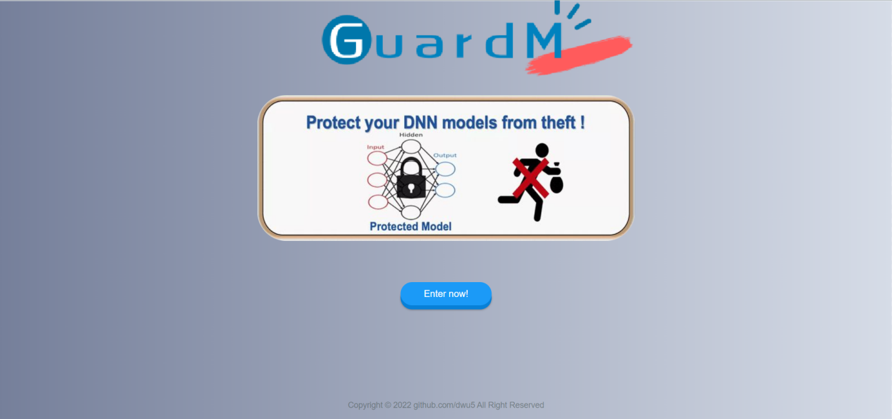

# GuardM

A simple demo of a deep learning model protection system.

Actually, it's the back-end module of the entire protection system. Its focus is to demonstrate the procedure of model protection business we set, not the algorithm itself. 

If you are interested in how we implement the deep learning algorithm, please refer to [our work](https://github.com/ByGary/Security-of-IP-Protection-Frameworks).

## Get started
`python manage.py makemigrations` to create a model and record data migration.

`python manage.py migrate` to update dataset.

`python manage.py createsuperuser` to create super user (administrator).

`python manage.py runserver` to start the built-in web server.
